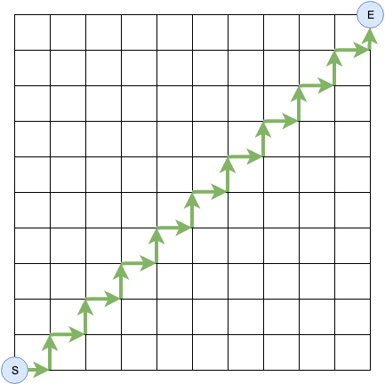
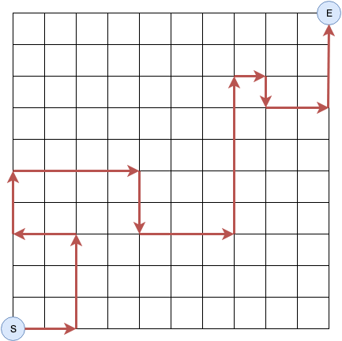

---
documentclass: scrartcl
geometry: margin=1in
...

# Challenge 03: Shortest path

September 23, 2019

## The challenge

You are in charge of route planning for a brand new navigation software
called Freerunner. The software aims to provide pedestrians with
directions, represented on a rectangular grid.

When directions from a source to a destination are requested, Freerunner
computes the directions as a series of 90 degree LEFT turns, 90 degree
RIGHT turns, an amount of time the user should walk forward, and an
ARRIVAL event.

Freerunner makes some assumptions about the world by abstracting
physical land into unit blocks. It assumes that:

 - it takes one (1) time unit to travel forward one (1) block
 - turns happen in place (i.e. turning does not move you off of a block)
 - and turning takes no time

For example, a series of instructions `10R1L3R1A` indicates that a user
should travel straight for 10 blocks, make a 90 degree right turn,
travel forward 1 block, make a 90 degree left turn, travel forward 3
blocks, then make a 90 degree right turn to arrive at their destination.
This takes a total of 15 time units.

Furthermore, Freerunner is an app for parkour enthusiasts who want to
get from one place to another as quickly as possible. It aims to
generate the shortest paths, even traversing through buildings and other
obstacles, because users will find a creative way around them.

Unfortunately, due to a bug in the mapping software, the open-world
&mdash; no obstacle is impassable &mdash; model is often violated, and
sometimes the directions it computes are not very efficient!! It will
often have people walking for far longer than necessary!

The product managers at Freerunner want to release their next feature as
quickly as possible and insist that there is no time to fix the bug!
Your team has been given one working hour to create a work-around!

Your task is to take a list of instructions generated by the buggy
Freerunner server and create a new list of instructions which minimize
the walking time.

## Assumptions and constraints

 - You may assume that input to your programs will always be valid.
   You do not need to write any error checking code.
 - You *must* write your solution using Python 3 code.
   Yes, even if you don't know it. See the syntax primer.
 - You *may not* use the Internet! Moderators will be spying on you to
   make sure you don't cheat!
 - Every 20 minutes there will be a rotation within your group. Make
   sure your teammates can pick up where you left off! There will be a
   total of two (2) rotations, so that you will work on each project for
   20 minutes.

\pagebreak

## Illustrated example

Imagine that you live in a city bound by the following 10 block by 10
block grid. You begin in the place marked $S$, and want to arrive at the
place marked $E$.

\vspace{10pt}
{ width=50% }
\vspace{10pt}

One of the shortest routes is depicted in the grid by the arrows,
traversing 20 blocks.

This path is represented by the string `0R1L1R1L1R1L1R...1L1R1L1R1A`.

There are at least two other paths in this grid that take the same
amount of time. Can you find them? What do their instruction strings
look like?

\vspace{20pt}

Freerunner will unfortunately generate instructions that might create a
long path like this:

\vspace{10pt}
{ width=50% }
\vspace{10pt}

This route is described by the string `0R2L3L2R2R4R2L3L5R1R1L2L3A`.

Such a path might avoid buildings, etc. but it's absolutely no good for
the parkour enthusiasts that Freerunner is targeting! It takes a whole
30 blocks!

## Input format

The input to your program will be a sequence of repeated letters and
numbers. There will always be at least one number before the next
letter. Instructions that indicate turning in place may appear with a
`0` prefix.

This input string may be described by the following regular expression:
`([0-9]+[LR])*[0-9]+A`

For example, the following are valid navigation instructions:

 1. `0R10L12R10R10R10R3L1A`
 2. `10A`
 3. `0A` (starting in destination space)
 4. `4L2R0L0R0L0R0L10A`

Repeated letters are not valid instructions. For example, the following
are not valid instructions:

 1. `A`
 2. `10RR3LA`
 3. `10AA`

etc.

## Output format

The format of the output is the same as the input format.

Your program must output the shortest valid instruction string that also
describes the shortest path.

You can validate the correctness of your program if given a shortest
path as input, the same path is produced as the output.

The most trivial case of this would be, as there are no possible
optimizations to be made.

$$0A \rightarrow program \rightarrow 0A$$

It may be the case that there are multiple shortest paths. Ensure that
your program is _consistent_ in how it picks which one to output.


## Running the program

Ensure that your python program is executable and accepts the following
options.

```
./pathfix.py INPUT [OUTPUT]
```

Where INPUT is the path to an input text file, and OUTPUT is an optional
path to the output file.

If no output file is supplied, then your program should print
the results to the console (`stdout`).

If an output file is specified and exists, your program should
**overwrite** the specified file. Otherwise, it should create it.

In other words, your program should be able to run like this:

```
./pathfix.py input.txt output.txt
```

or like this:

```
./pathfix.py input.txt
```
